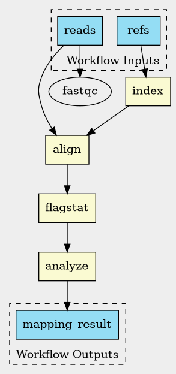

# ДЗ 3

## Ссылки на загруженные прочтения из NCBI SRA

[Референс](https://ftp.ncbi.nlm.nih.gov/genomes/all/GCF/000/005/845/GCF_000005845.2_ASM584v2/GCF_000005845.2_ASM584v2_genomic.fna.gz)

[Риды](https://trace.ncbi.nlm.nih.gov/Traces/?view=run_browser&acc=SRR31649172&display=download)

## Скрипт на bash с реализованным алгоритмом
[script.sh](./script.sh)

## Результат команды `samtools flagstat`
```text
2149942 + 0 in total (QC-passed reads + QC-failed reads)
1084964 + 0 primary
117176 + 0 secondary
947802 + 0 supplementary
0 + 0 duplicates
0 + 0 primary duplicates
2040167 + 0 mapped (94.89% : N/A)
975189 + 0 primary mapped (89.88% : N/A)
0 + 0 paired in sequencing
0 + 0 read1
0 + 0 read2
0 + 0 properly paired (N/A : N/A)
0 + 0 with itself and mate mapped
0 + 0 singletons (N/A : N/A)
0 + 0 with mate mapped to a different chr
0 + 0 with mate mapped to a different chr (mapQ>=5)
```

## Скрипт разбора файлов с этими результатами

В основном скрипте [script.sh](./script.sh) в конце разбираются результаты

```bash
echo "5. Analyzing mapping percentage"
result=$(echo "$samtools_output" | grep -oP 'mapped \(\K[\d.]+(?=%)' | head -1)
```

## Инструкция по развертыванию и установке фреймворка
[инструкция с оф сайта](https://www.commonwl.org/user_guide/introduction/quick-start.html)

- установка обычным 
`pip install cwltool`
- добавить `~/.local/bin` в `PATH`

## Код любого тестового пайплайна (“Hello world”) на фреймворке
[helloworld.cwl](./helloworld.cwl)

## Результаты работы пайплайна на фреймворке и лог-файлы
[helloworld.log](./helloworld.log)

## Код пайплайна “оценки качества картирования” на фреймворке
точка входа: [pipeline/main.cwl](./pipeline/main.cwl)
[pipeline/fastqc.cwl](./pipeline/fastqc.cwl)
[pipeline/index-ref.cwl](./pipeline/index-ref.cwl)
[pipeline/align-reads.cwl](./pipeline/align-reads.cwl)
[pipeline/analyze-mapping.cwl](./pipeline/analyze-mapping.cwl)

## Выведенные результаты работы пайплайна на загруженных данных в отдельном файле
[pipeline/pipeline_output.txt](pipeline/pipeline_output.txt)
```text
{
    "mapping_result": "Mapped 94.89%\nOK\n"
}
```

## Лог-файлы работы пайплайна на загруженных данных
[pipeline/pipeline.log](pipeline/pipeline.log)

## Визуализация пайплайна в виде графического файла


## Описание использованного способа визуализации и отличия полученной визуализации от блок-схемы алгоритма в свободной форме

`cwltool --print-dot pipeline/main.cwl | dot -Tpng -o pipeline.png`

Получен файл pipeline.png, отображающий структуру пайплайна в виде направленного графа.

Визуализация выполнена с помощью инструмента dot из пакета Graphviz. DAG отражает потоки данных между шагами пайплайна, но не показывает циклов или обратных связей, что отличает его от классической блок-схемы алгоритма.